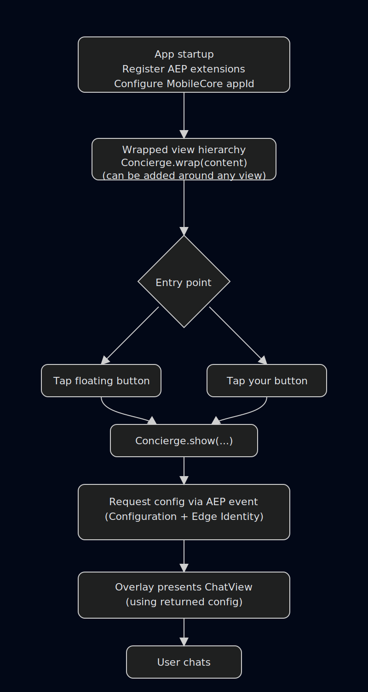

## Brand Concierge (AEPBrandConcierge) Implementation Guide

### Overview

Brand Concierge serves to provide an in app conversational UI (a chat surface) that can be embedded into a host app with minimal UI wiring, connect that UI to Adobe Experience Platform by using AEP SDK shared state (Configuration + Edge Identity) to derive the service configuration needed to run a session, and enable brand controlled experiences through configuration and theming.

The Brand Concierge UI is presented in two steps:

- **Enable UI presentation** by wrapping your SwiftUI root with `Concierge.wrap(...)`
- **Open the chat** by calling `Concierge.show(...)`

Internally, `Concierge.show(...)` dispatches an event in the Adobe Experience Platform Mobile SDK that the Concierge extension handles to build a `ConciergeConfiguration`, then the SwiftUI overlay presents `ChatView`.



---

## Pre requisites

### Required SDK modules

Your app needs these AEP modules available and registered:

- **AEPCore** (MobileCore, Configuration shared state comes from `configureWith(appId:)`)
- **AEPEdge**
- **AEPEdgeIdentity**
- **AEPBrandConcierge**

### iOS version

- Minimum iOS 15.0+

### Permissions for speech to text (optional)

Speech to text uses iOS Speech + microphone APIs. Add these to your app `Info.plist`:

- **`NSMicrophoneUsageDescription`**
- **`NSSpeechRecognitionUsageDescription`**

---

## Configuration

### Step 1: Set up the Adobe Experience Platform Mobile SDK

Follow the [Adobe Experience Platform Mobile SDK getting started guide](https://developer.adobe.com/client-sdks/home/getting-started/) to set up the base SDK integration used by Concierge.

The required extensions are:

- AEPCore
- AEPEdge
- AEPEdgeIdentity
- AEPBrandConcierge

### Step 2: Validate the Brand Concierge configuration keys exist

If you set the Mobile SDK log level to trace (`MobileCore.setLogLevel(.trace)`), you can inspect the app logs to confirm that extension shared states are being set with the expected values.

Brand Concierge expects the following keys to be present in the Configuration shared state:

- **`concierge.server`**: String (server host or base domain used by Concierge requests)
- **`concierge.configId`**: String (datastream id)
- **`concierge.surfaces`**: Array of String (one or more surface names)

ECID is read from Edge Identity shared state.

Another option for validation is to use Adobe Assurance. Refer to the [Mobile SDK validation guide](https://developer.adobe.com/client-sdks/home/getting-started/validate/).

---

## Optional styling

### Theme injection (recommended)

The UI reads styling from the SwiftUI environment value `conciergeTheme`. You can load a theme JSON and apply it above `Concierge.wrap(...)` so both the floating button and the overlay share it:

```swift
let theme = ConciergeThemeLoader.load(from: "theme-default", in: .main) ?? ConciergeThemeLoader.default()

var body: some View {
    Concierge.wrap(AppRootView(), hideButton: true)
        .conciergeTheme(theme)
}
```

---

## Basic usage

### Option A - Manual API call (no floating button)

Use this when you want full control over where the entry point lives.

1) Wrap your root content and hide the built in button:

```swift
Concierge.wrap(AppRootView(), hideButton: true)
```

2) Trigger chat from your own UI:

```swift
Button("Chat") {
    Concierge.show(title: "Concierge", subtitle: "Powered by Adobe")
}
```

Optional:
- Provide **speech capture** by using the default (it is created internally if you do not pass one).
- Provide **text to speech** by passing a `TextSpeaking` implementation (text to speech is not enabled by default unless you supply one).

### Option B - Floating button (built in)

Use this when you want a drop in entry point.

```swift
Concierge.wrap(AppRootView()) // hideButton defaults to false
```

This renders a floating button in the bottom trailing corner; tapping it calls `Concierge.show()`.

### Closing the UI

From code, you can dismiss the overlay with:

```swift
Concierge.hide()
```

### UIKit usage

Use this when your app is UIKit based and you want to present Concierge from a `UIViewController`.

#### Present the chat UI

Call `Concierge.present(on:title:subtitle:)` from the view controller that should host the chat UI:

```swift
import AEPBrandConcierge

final class MyViewController: UIViewController {
    @objc private func openChat() {
        Concierge.present(on: self, title: "Concierge", subtitle: "Powered by Adobe")
    }
}
```

#### Dismiss the chat UI

To dismiss the presented UI, call:

```swift
Concierge.hide()
```