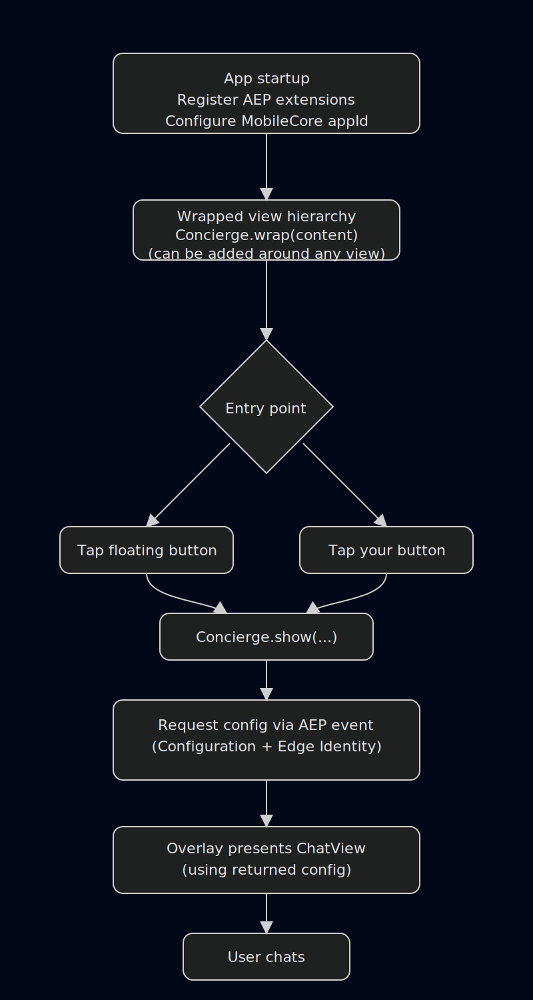

## Brand Concierge (AEPBrandConcierge) Implementation Guide

### Overview

Brand Concierge serves to provide an in app conversational UI (a chat surface) that can be embedded into a host app with minimal UI wiring, connect that UI to Adobe Experience Platform by using AEP SDK shared state (Configuration + Edge Identity) to derive the service configuration needed to run a session, and enable brand controlled experiences through configuration and theming.

The Brand Concierge UI is presented in two steps:

- **Enable UI presentation** by wrapping the app's SwiftUI root with `Concierge.wrap(...)`
- **Open the chat** by calling `Concierge.show(...)`

Internally, `Concierge.show(...)` dispatches an event in the Adobe Experience Platform Mobile SDK that the Concierge extension handles to build a `ConciergeConfiguration`, then the SwiftUI overlay presents `ChatView`.



---

## Pre requisites

### Required SDK modules

The host app needs these AEP modules available and registered:

- **AEPCore** (MobileCore, Configuration shared state comes from `configureWith(appId:)`)
- **AEPEdge**
- **AEPEdgeIdentity**
- **AEPBrandConcierge**

### iOS version

- Minimum iOS 15.0+

### Permissions for speech to text (optional)

Speech to text uses iOS Speech + microphone APIs. Add these to the app's `Info.plist`:

- **`NSMicrophoneUsageDescription`**
- **`NSSpeechRecognitionUsageDescription`**

The SDK handles permission requests internally when the user taps the microphone button; no additional permission-request code is required from the host app.

---

## Installation

Add Brand Concierge alongside the other AEP SDK extensions using either Swift Package Manager or CocoaPods.

### Swift Package Manager

Add the package to the app's `Package.swift`:

```swift
dependencies: [
    .package(url: "https://github.com/adobe/aepsdk-concierge-ios.git", .upToNextMajor(from: "5.0.0")),
    .package(url: "https://github.com/adobe/aepsdk-core-ios.git", .upToNextMajor(from: "5.7.0")),
    .package(url: "https://github.com/adobe/aepsdk-edge-ios.git", .upToNextMajor(from: "5.0.3")),
    .package(url: "https://github.com/adobe/aepsdk-edgeidentity-ios.git", .upToNextMajor(from: "5.0.0"))
]
```

Then add the products to the target's dependencies:

```swift
.product(name: "AEPBrandConcierge", package: "aepsdk-concierge-ios"),
.product(name: "AEPCore", package: "aepsdk-core-ios"),
.product(name: "AEPEdge", package: "aepsdk-edge-ios"),
.product(name: "AEPEdgeIdentity", package: "aepsdk-edgeidentity-ios"),
```

Alternatively, add the package in Xcode via **File -> Add Package Dependencies…** using `https://github.com/adobe/aepsdk-concierge-ios.git`.

### CocoaPods

Add the following to the app's `Podfile`:

```ruby
pod 'AEPBrandConcierge', '~> 5.0'
pod 'AEPCore', '~> 5.7'
pod 'AEPEdge', '~> 5.0'
pod 'AEPEdgeIdentity', '~> 5.0'
```

Then run `pod install`.

---

## Configuration

### Step 1: Set up the Adobe Experience Platform Mobile SDK

Follow the [Adobe Experience Platform Mobile SDK getting started guide](https://developer.adobe.com/client-sdks/home/getting-started/) to set up the base SDK integration used by Concierge.

The required extensions are:

- AEPCore
- AEPEdge
- AEPEdgeIdentity
- AEPBrandConcierge

### Step 2: Validate the Brand Concierge configuration keys exist

Setting the Mobile SDK log level to trace (`MobileCore.setLogLevel(.trace)`) causes extension shared states to be logged, making it possible to confirm in the app logs that they are being set with the expected values.

Brand Concierge expects the following keys to be present in the Configuration shared state:

- **`concierge.server`**: String (server host or base domain used by Concierge requests)
- **`concierge.configId`**: String (datastream id)

ECID is read from Edge Identity shared state. Surfaces are not a Configuration key; they are supplied per session via the `surfaces:` parameter on `Concierge.wrap(...)`, `Concierge.show(...)`, or `Concierge.present(on:...)`.

Another option for validation is to use Adobe Assurance. Refer to the [Mobile SDK validation guide](https://developer.adobe.com/client-sdks/home/getting-started/validate/).

---

## Optional styling

### Theme injection (recommended)

The UI reads styling from the SwiftUI environment value `conciergeTheme`. A theme JSON can be loaded and applied above `Concierge.wrap(...)` so both the floating button and the overlay share it:

```swift
let theme = ConciergeThemeLoader.load(from: "theme-default", in: .main) ?? ConciergeThemeLoader.default()

var body: some View {
    Concierge.wrap(AppRootView(), surfaces: ["my-surface"], hideButton: true)
        .conciergeTheme(theme)
}
```

More information regarding theme customization can be found in the [style-guide](./style-guide.md).

---

## Basic usage

### API reference

Brand Concierge requires a list of **surface identifiers** to resolve the correct chat configuration on the BC server. Every chat session is started with surfaces, either directly via `show(...)` / `present(on:...)` or, when using the built-in floating button, via the value stored by `wrap(...)`.

#### `Concierge.wrap(_:surfaces:title:subtitle:hideButton:handleLink:)`

> [!IMPORTANT]: The `surfaces`, `title`, `subtitle`, and `handleLink` parameters on `wrap(...)` only apply when chat is triggered via the built-in floating button. When chat is triggered via `Concierge.show(...)` or `Concierge.present(on:...)`, the values passed to those APIs are used instead.

- **`content`** *(required)*: The SwiftUI content to wrap.
- **`surfaces`**: Surfaces for the chat session. Sent to the Brand Concierge server to resolve the chat configuration.
- **`title`**: Header title text shown at the top of the chat.
- **`subtitle`**: Header subtitle text shown at the top of the chat.
- **`hideButton`**: When `true`, hides the built-in floating button so chat can be triggered from custom host-app UI. Defaults to `false`.
- **`handleLink`**: Optional callback invoked before the SDK's default link routing. Return `true` to claim the URL; return `false` to let the SDK handle it normally.

#### `Concierge.show(surfaces:title:subtitle:speechCapturer:textSpeaker:handleLink:)`

- **`surfaces`** *(required)*: Surfaces for this chat session. Sent to the Brand Concierge server to resolve the chat configuration.
- **`title`**: Header title text shown at the top of the chat for this session.
- **`subtitle`**: Header subtitle text shown at the top of the chat for this session.
- **`speechCapturer`**: Custom `SpeechCapturing` implementation. If `nil`, the SDK creates the default speech capturer internally.
- **`textSpeaker`**: Custom `TextSpeaking` implementation. If `nil`, text to speech is disabled.
- **`handleLink`**: Optional callback invoked before the SDK's default link routing. Return `true` to claim the URL; return `false` to let the SDK handle it normally.

#### `Concierge.present(on:surfaces:title:subtitle:speechCapturer:textSpeaker:handleLink:)`

- **`on presentingViewController`** *(required)*: The UIKit view controller that will host the chat UI as a child view controller, filling its view.
- **`surfaces`** *(required)*: Surfaces for this chat session. Sent to the Brand Concierge server to resolve the chat configuration.
- **`title`**: Header title text shown at the top of the chat for this session.
- **`subtitle`**: Header subtitle text shown at the top of the chat for this session.
- **`speechCapturer`**: Custom `SpeechCapturing` implementation. If `nil`, the SDK creates the default speech capturer internally.
- **`textSpeaker`**: Custom `TextSpeaking` implementation. If `nil`, text to speech is disabled.
- **`handleLink`**: Optional callback invoked before the SDK's default link routing. Return `true` to claim the URL; return `false` to let the SDK handle it normally.

### Option A - Manual API call (no floating button)

Use this for full control over where the entry point lives.

1) Wrap the root content and hide the built in button:

```swift
Concierge.wrap(AppRootView(), surfaces: ["my-surface"], hideButton: true)
```

2) Trigger chat from custom host-app UI:

```swift
Button("Chat") {
    Concierge.show(surfaces: ["my-surface"], title: "Concierge", subtitle: "Powered by Adobe")
}
```

### Option B - Floating button (built in)

Use this for a drop in entry point.

```swift
Concierge.wrap(AppRootView(), surfaces: ["my-surface"]) // hideButton defaults to false
```

This renders a floating button in the bottom trailing corner; tapping it calls `Concierge.show(surfaces:)`.

### Closing the UI

From code, the overlay can be dismissed with:

```swift
Concierge.hide()
```

### UIKit usage

Use this for UIKit-based apps that present Concierge from a `UIViewController`.

#### Present the chat UI

Call `Concierge.present(on:surfaces:title:subtitle:)` from the view controller that should host the chat UI:

```swift
import AEPBrandConcierge

final class MyViewController: UIViewController {
    @objc private func openChat() {
        Concierge.present(on: self, surfaces: ["my-surface"], title: "Concierge", subtitle: "Powered by Adobe")
    }
}
```

#### Dismiss the chat UI

To dismiss the presented UI, call:

```swift
Concierge.hide()
```

---

## Link Handling

### Default behavior

When a user taps a link in the chat, the SDK routes it through `ConciergeLinkHandler` using the following flow:

1. **Custom scheme URLs** (e.g. `myapp://`, `mailto:`, `tel:`) — opened immediately via the system (deep link).
2. **http/https URLs** — the system is first asked to open the URL as a universal link. If the host app has registered the URL's domain via [Associated Domains](https://developer.apple.com/documentation/bundleresources/entitlements/com_apple_developer_associated-domains), the app handles the navigation natively. Otherwise, the URL falls back to the in-app WebView overlay.

**Default link handling flow:** host `handleLink` callback (if provided) -> deep link / universal link check -> WebView overlay.

### Custom link handling

All three public APIs accept an optional `handleLink` closure that is called before the SDK's default routing. Return `true` to claim the URL (the SDK takes no further action). Return `false` to let the SDK handle it normally.

#### SwiftUI — `Concierge.wrap()`

```swift
Concierge.wrap(
    AppRootView(),
    surfaces: ["my-surface"],
    hideButton: true,
    handleLink: { url in
        if url.scheme == "myapp" {
            Concierge.hide()
            // Navigate to in-app destination
            return true
        }
        return false
    }
)
```

#### SwiftUI — `Concierge.show()`

```swift
Concierge.show(
    surfaces: ["my-surface"],
    title: "Concierge",
    subtitle: "Powered by Adobe",
    handleLink: { url in
        if url.host == "myapp.example.com" {
            Concierge.hide()
            return true
        }
        return false
    }
)
```

#### UIKit — `Concierge.present(on:)`

```swift
Concierge.present(
    on: self,
    surfaces: ["my-surface"],
    title: "Concierge",
    subtitle: "Powered by Adobe",
    handleLink: { url in
        if url.scheme == "myapp" {
            Concierge.hide()
            // Navigate using UIKit navigation
            return true
        }
        return false
    }
)
```

When `handleLink` returns `true`, the SDK does not open the WebView overlay or perform any further link routing. When it returns `false` or is not provided, the SDK uses the default flow (deep link check -> universal link check -> WebView overlay).

### Universal links

To have the SDK open http/https URLs natively in the host app instead of the in-app WebView, configure [Associated Domains](https://developer.apple.com/documentation/bundleresources/entitlements/com_apple_developer_associated-domains) for the app and host an `apple-app-site-association` file on the associated domain. When the domain is verified, tapping a link for that domain in the chat will navigate within the app instead of the WebView.

Alternatively, use the `handleLink` callback to intercept specific domains and handle them with custom navigation logic without requiring domain verification.

### In-app WebView overlay link handling

Links clicked *inside* the in-app WebView overlay (ex: links on a page that has already loaded in the overlay) follow their own routing rules, independent of the `handleLink` callback:

- **`http` / `https` / `about` URLs**: Loaded within the WebView.
- **Non-web schemes** (ex: `mailto:`, `tel:`, `sms:`, `myapp://`): The WebView cancels the navigation and forwards the URL to the system via `UIApplication.open`, which routes it to the appropriate handler app (Mail, Phone, Messages, a custom deep-link destination, etc.).

No additional configuration is required for this behavior. Universal-link forwarding for in-chat links (the `handleLink` -> universal link -> WebView fallback described above) applies only to links tapped in chat messages; it is not re-evaluated for links inside an already loaded WebView page.